# Database - III & Supabase

## Agenda:

- Common Constraints
- SQL Aggregation
- Nested/Sub-query
- Group By Clause
- Having Clause
- Joins
- Supabase &rarr; Postgres

---

## Common Constraints

| Contraint   | Meaning              |
| ----------- | -------------------- |
| PRIMARY KEY | unique identifier    |
| NOT NULL    | cannot be empty      |
| UNIQUE      | no duplicates        |
| CHECK       | condition validation |
| FOREIGN KEY | relation enforcement |

### Example of CHECK Constraint

```SQL
CREATE TABLE employees (
  emp_id INTEGER PRIMARY KEY,
  name TEXT NOT NULL CHECK (length(name) > 3),
  salary INTEGER,
  dept_id INTEGER,
  FOREIGN KEY (dept_id) REFERENCES departments(dept_id)
);
```

---

## Preparing Data to Work With

```````SQL
CREATE TABLE employees (
  id INT PRIMARY KEY,
  name TEXT,
  department TEXT,
  salary INT,
  city TEXT
);

INSERT INTO employees (id, name, department, salary, city) VALUES
(1, 'Rahul', 'IT', 70000, 'Bengaluru'),
(2, 'Neha', 'HR', 60000, 'Delhi'),
(3,'Aman', 'IT', 80000, 'Mumbai'),
(4, 'Sara', 'Finance', 75000, 'Bengaluru'),
(5, 'John', 'HR', 65000, 'Pune'),
(6, 'Riya', 'IT', 90000, 'Delhi');

SELECT * FROM employees;
```````

---

## SQL Aggregation

### 1. COUNT()

Counts the number of rows.

```SQL
SELECT COUNT(*)
FROM employees;
```

P.S. : Number of employees in IT

```SQL
SELECT COUNT(*) 
FROM employees 
WHERE department = 'IT';
```

### 2. SUM()

Calculates the total value.

P.S. : Total salary paid by company

```SQL
-- without alias
SELECT SUM(salary) 
FROM employees;

-- with alias
SELECT SUM(salary) 
AS total_salary_paid 
FROM employees;
```

### 3. AVG()

Calculates the average value.

P.S. : Average salary paid by company

```SQL
SELECT AVG(salary)
AS average_salary_paid
FROM employees;
```

### 4. MIN() & MAX()

Lowest Salary:

```SQL
SELECT MIN(salary)
AS minimum_salary_paid
FROM employees;
```

Highest Salary:

```SQL
SELECT MAX(salary)
AS maximum_salary_paid
FROM employees;
```

---

## Nested Query

P.S. : Employee with the highest salary

```SQL
-- Approach 1 : Using MAX()
SELECT name 
AS highest_salary_employee, MAX(salary) 
AS highest_salary_paid
FROM employees;

-- Approach 2 : Using ORDER BY and LIMIT()
SELECT name 
AS highest_salary_employee, salary
AS highest_salary_paid
FROM employees
ORDER BY salary
DESC
LIMIT(1);

-- Approach 3 : Using nested / sub-query
SELECT name 
AS highest_salary_employee, salary
AS highest_salary_paid
FROM employees
WHERE salary = (
  SELECT MAX(salary)
  FROM employees
);
```

---

## GROUP BY Clause

- GROUP BY groups rows based on column values
- Then Aggregate functions are applied per group

P.S. : What is the average salary per department ?

```SQL
SELECT department, AVG(salary)
AS dept_avg_sal 
FROM employees 
GROUP BY department;
```

P.S. : Count employees per city

```SQL
SELECT city, COUNT(*)
AS number_of_employees
FROM employees
GROUP BY city;
```

---

## HAVING Clause

Having filters groups, not rows.

P.S. : Departments with average salary above 70000

```SQL
SELECT department, AVG(salary)
AS dept_avg_sal
FROM employees
GROUP BY department
HAVING dept_avg_sal > 70000;
```

---

## WHERE v/s HAVING

| Feature         | WHERE    | HAVING         |
| --------------- | -------- | -------------- |
| Filters         | rows     | groups         |
| Used before     | GROUP BY | after GROUP BY |
| Uses aggregates | ❌       | ✅             |

---

## Flow of Query

```SQL
SELECT department, AVG(salary)
AS dept_avg_sal
FROM employees
WHERE city = 'Delhi'
GROUP BY department
HAVING dept_avg_sal > 70000
ORDER BY dept_avg_sal DESC
LIMIT(3);
```

The above query fetches the top 3 departments by salary whose city is Delhi and average salary is greater than 70000

So actual flow is:

```HTML
FROM → WHERE → GROUP BY → HAVING → SELECT → ORDER BY → LIMIT
```

---

## JOINs

- INNER JOIN
- LEFT JOIN
- RIGHT JOIN
- FULL JOIN

To use joins you need multiple tables.

Creating tables for JOINs topic:

```SQL
CREATE TABLE departments (
  dept_id INTEGER PRIMARY KEY,
  dept_name TEXT NOT NULL
);

CREATE TABLE employees (
  emp_id INTEGER PRIMARY KEY,
  name TEXT NOT NULL,
  salary INTEGER,
  dept_id INTEGER,
  FOREIGN KEY (dept_id) REFERENCES departments(dept_id)
);

CREATE TABLE projects (
  project_id INT PRIMARY KEY,
  project_name TEXT
);

CREATE TABLE employee_projects (
  emp_id INTEGER,
  project_id INTEGER,
  FOREIGN KEY (emp_id) REFERENCES employees(emp_id),
  FOREIGN KEY (project_id) REFERENCES projects(project_id)
);
```

Inserting data in above tables to perform JOINs:

```SQL
INSERT INTO departments (dept_id, dept_name)
 VALUES (1, 'IT'),
		(2, 'HR'),
        (3, 'Finance'),
        (4, 'Marketing');

INSERT INTO employees (emp_id, name, salary, dept_id)
 VALUES (1, 'Rahul', 70000, 1),
 		(2, 'Neha', 60000, 2),
        (3, 'Aman', 80000, 1),
        (4, 'Sara', 75000, 3),
        (5, 'John', 65000, 2),
        (6, 'Riya', 90000, 1),
        (7, 'David', 72000, NULL);

INSERT INTO projects (project_id, project_name)
 VALUES (1, 'AI Platform'),
 		(2, 'HR Automation'),
        (3, 'Finance Dashboard');

INSERT INTO employee_projects (emp_id, project_id)
 VALUES (1, 1),
 		(3, 1),
        (2, 2),
        (4, 3),
        (6, 1);
```

P.S. (JOINs) : Get employee name and department name

### INNER JOIN

INNER JOIN returns only rows where matching data exists in both tables.

Query:

```SQL
SELECT emp.name AS emp_name, dept.dept_name AS dept_name
FROM employees emp
INNER JOIN departments dept
ON emp.dept_id = dept.dept_id;
```

### LEFT JOIN

All rows from LEFT table + matching rows from RIGHT table.

If no match &rarr; NULL.

Query:

```SQL
SELECT emp.name AS emp_name, dept.dept_name AS dept_name
FROM employees emp
LEFT JOIN departments dept
ON emp.dept_id = dept.dept_id;
```

### RIGHT JOIN

All rows from RIGHT table + matching rows from LEFT table.

If no match &rarr; NULL.

Query:

```SQL
-- RIGHT JOIN via LEFT JOIN
SELECT emp.name AS emp_name, dept.dept_name AS dept_name
FROM departments dept
LEFT JOIN employees emp
ON emp.dept_id = dept.dept_id;

-- RIGHT JOIN
SELECT emp.name AS emp_name, dept.dept_name AS dept_name
FROM employees emp
RIGHT JOIN departments dept
ON emp.dept_id = dept.dept_id;
```

### FULL JOIN

All rows from both the tables.

Formula : LEFT JOIN + RIGHT JOIN - INNER JOIN

Query:

```sql
-- FULL JOIN via LEFT JOIN, RIGHT JOIN & UNION
SELECT emp.name AS emp_name, dept.dept_name AS dept_name
FROM employees emp
LEFT JOIN departments dept
ON emp.dept_id = dept.dept_id
  
  UNION
  
SELECT emp.name AS emp_name, dept.dept_name AS dept_name
FROM employees emp
RIGHT JOIN departments dept
ON emp.dept_id = dept.dept_id;

-- FULL JOIN
SELECT emp.name AS emp_name, dept.dept_name AS dept_name
FROM employees emp
FULL JOIN departments dept
ON emp.dept_id = dept.dept_id;
```


---

## Supabase

1. First Register yourself in [https://supabase.com/](https://supabase.com/)
2. Create your organization
   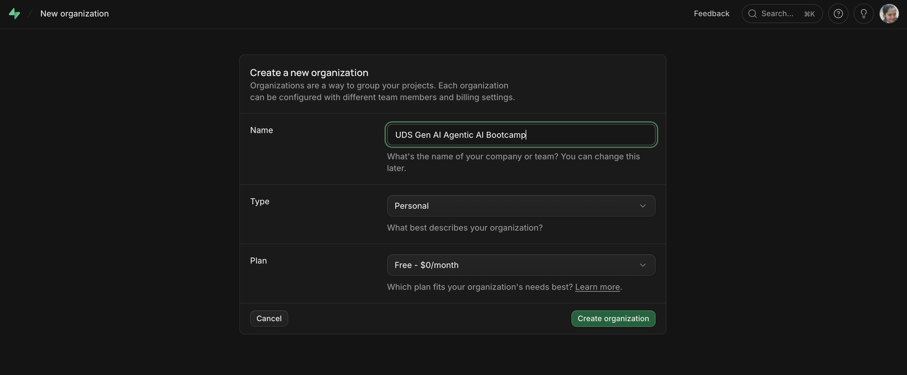
3. Create your project
   Project Name : uds database 3
   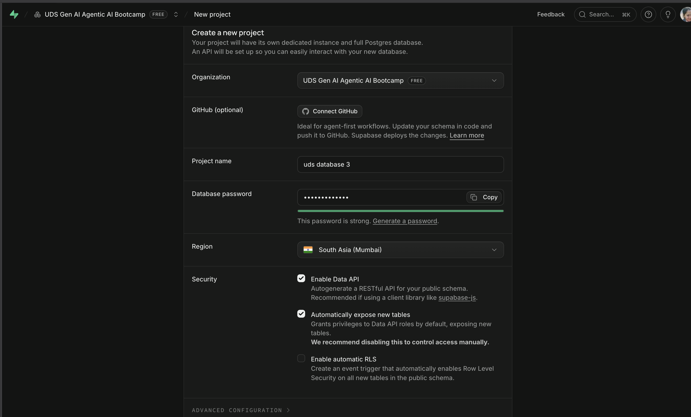

   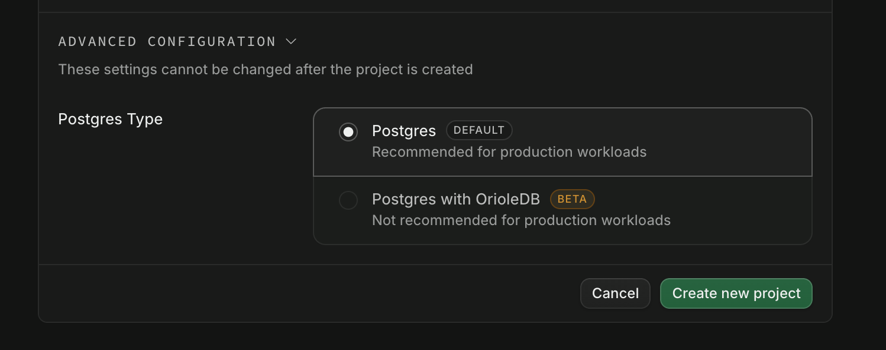
4. Click on Database
   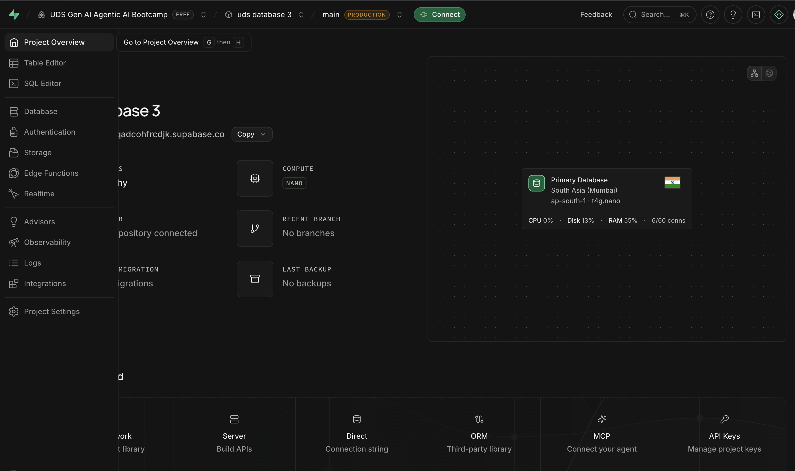
5. Click on New Table
   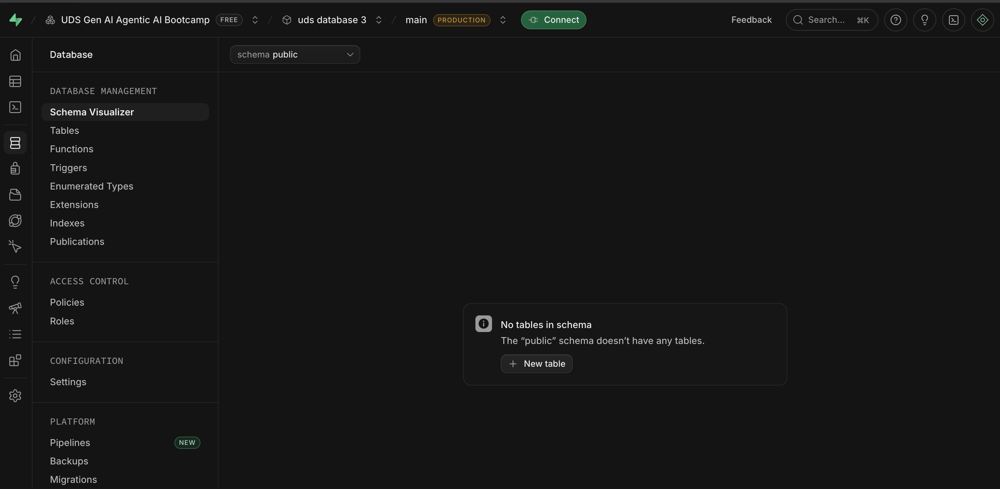
6. Add the table name and columns of the table
   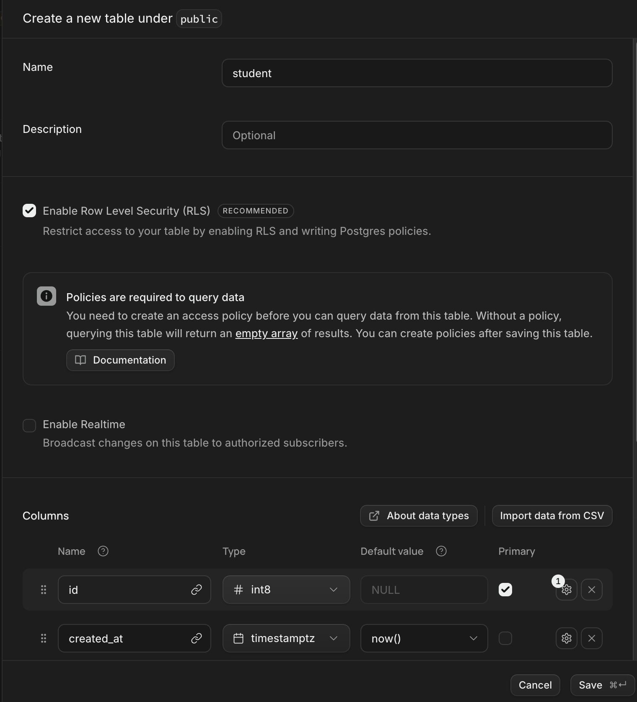

   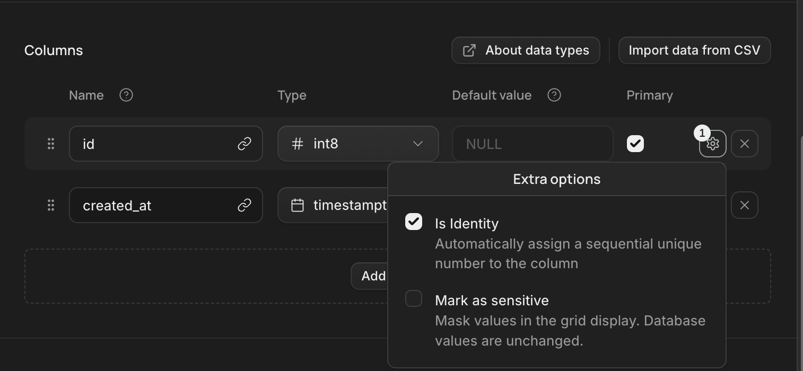

   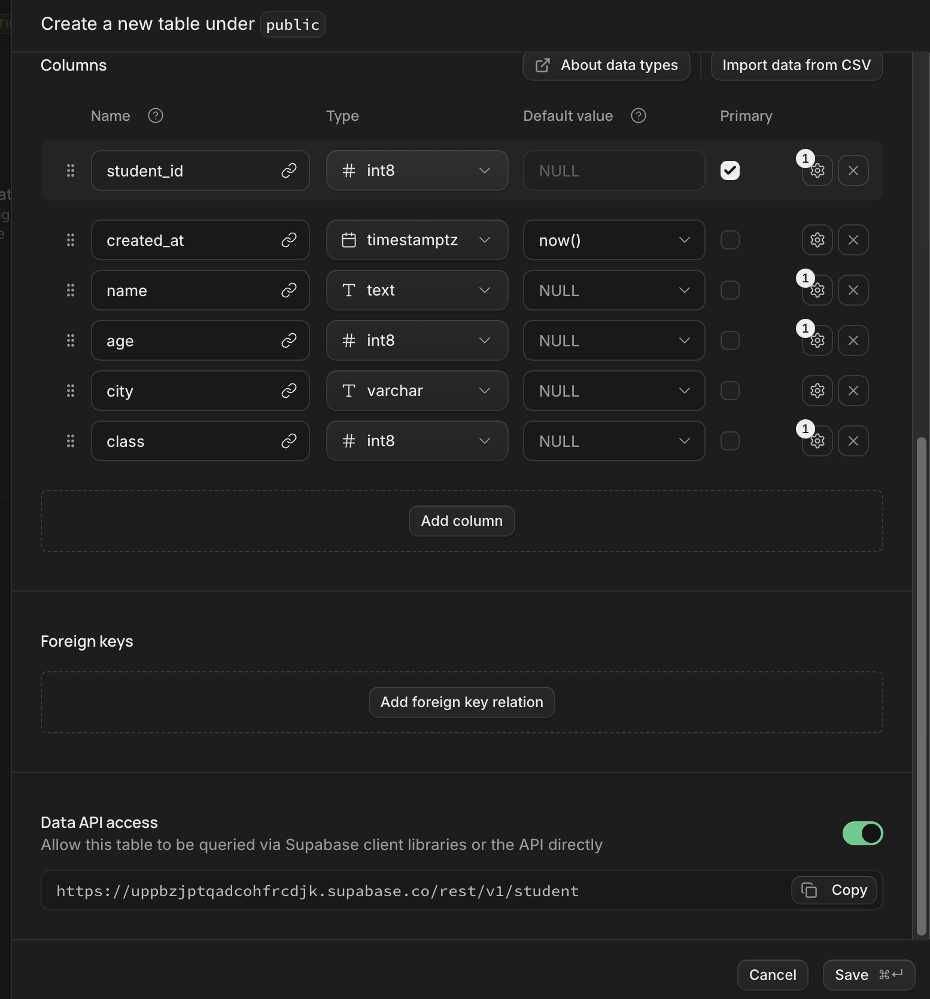
7. Click on Save button and the table is created
   

   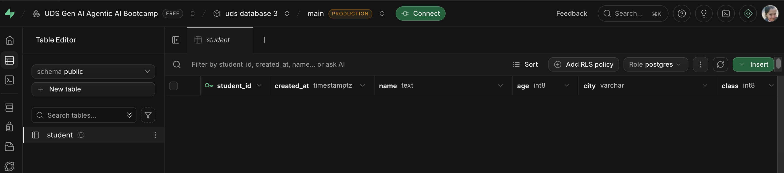
8. Insert your data and Save it
   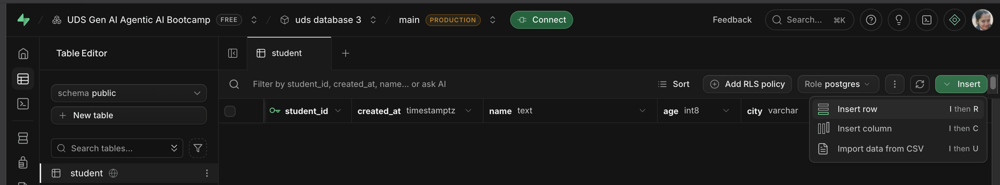

   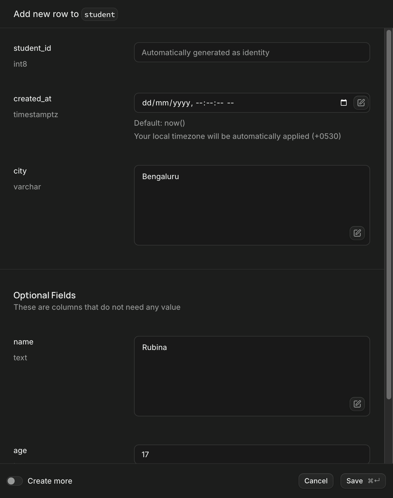

   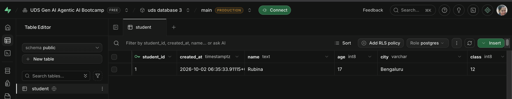

---
